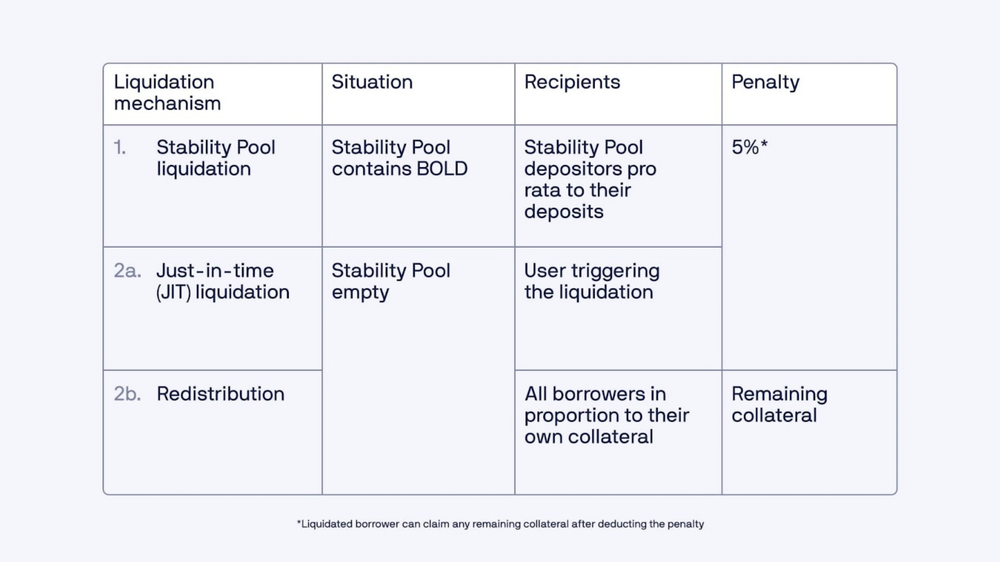
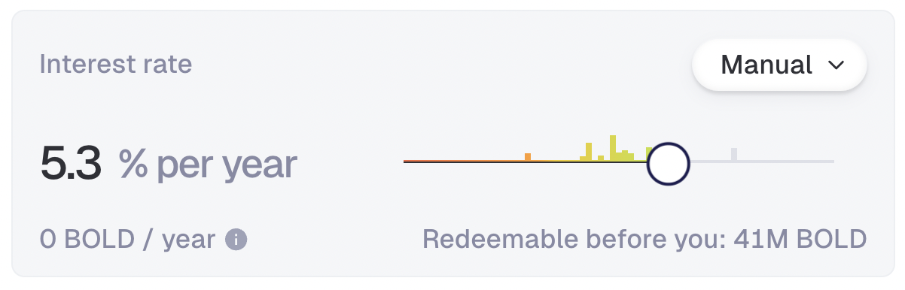

# 借贷与清算

### V2 的借贷为何如此独特？

Liquity V2 开创性地采用用户自定义利率，允许用户按照自己的条件借入稳定币 BOLD。借款人可以选择并调整他们愿意为贷款支付的利率。借款人将根据其个人风险承受能力建立市场利率，而无需依赖治理或算法利率管理。每种抵押品也将有其各自的借贷市场，为利率市场的发展留下空间。

Liquity V2 建立在 V1 引入的基础之上 - 一个高度安全且不可变的协议，发行加密货币中最去中心化的稳定币。

所做的这些都是为了使资本效率变高、提供安全且去中心化的借贷体验，这是其他协议所不能比拟的。

### 为什么 Liquity 不运营自己的前端？

为了提高协议的去中心化和弹性，Liquity AG 不运营中央前端。相反，用户可以从多个集成和社区运行的实例中进行选择，让他们自由选择最适合自己需求的实例。

### 如何选择使用哪个前端？

前端选择是一个个人决定，取决于各种因素，包括 UI/UX、附加功能以及利率管理策略。

你可以在这里选择一个：[https://www.liquity.org/frontend-v2](https://www.liquity.org/frontend-v2)

### 我可以运行自己的本地实例吗？

是的，只需按照这里的说明操作：[https://github.com/liquity/bold/tree/main/frontend/app](https://github.com/liquity/bold/tree/main/frontend/app)

### 什么是 Trove？&#x20;

Trove 是 Liquity 版本的"金库"。每个 Trove 链接到一个以太坊地址，每个地址可以拥有多个 Trove。

每个 Trove 允许你管理一笔贷款，根据需要调整抵押品和债务值，以及设置自己的利率。

### 我可以使用什么类型的抵押品？

你可以使用 ETH、Lido ETH（wstETH）和 Rocket Pool ETH（rETH）。

### 有最低债务吗？

是的，借款需要至少 2,000 BOLD 的最低债务。

### **我什么时候需要偿还贷款？**

协议发行的贷款没有还款计划。只要你保持健康的 LTV，你可以让 Trove 保持开放并随时偿还债务。

### 有锁定期吗？ 

没有锁定期。用户可以随时提取他们的抵押品存款。作为例外，如果借贷市场的总 LTV 超过 75%，借款人的提款将暂时暂停。

### 我如何决定我的 LTV？

这取决于你的个人偏好，主要是你的风险承受能力以及你想多积极地管理你的仓位。为了帮助你做出决定，你会在用户界面上找到可以作为指南的预设选项。

<figure><figcaption>
LTV 快速选择选项
</figcaption></figure>

请注意，这些示例仅用于说明目的，不代表确定的风险或安全阈值。作为用户，确定你自己的风险承受能力和舒适度至关重要。

如果你的 LTV 变得太高，你的仓位将被清算。

### Liquity V2 中的清算如何工作？

如果 LTV 超过最大值（ETH 为 90.91%，wstETH 和 rETH 为 83.33%），Trove 将被清算。

Liquity v2 使用稳定池作为其主要清算机制来吸收清算的债务和抵押品。每个借贷市场都有自己专用的稳定池，通过燃烧债务来换取清算收益（以相应的抵押品计）。&#x20;

当稳定池为空时，即时清算和债务及抵押品在同一市场的借款人之间的重新分配作为最后手段处理清算。

被清算的借款人通常会产生 5% 的罚款，并能够在清算后认领剩余的抵押品。

一种特殊情况是需要重新分配时，那么：

-   对于 ETH，损失最多为债务的 10%。这相当于以抵押品表示的最大损失为 9.09%。
-   对于 rETH/wstETH，损失为债务的 20%，相当于以抵押品表示的最大损失为 16.67%。

<figure><figcaption></figcaption></figure>

### 清算 Trove 我如何获得补偿？ 

Trove 的清算与某些 gas 成本相关，发起人必须承担。协议提供由以下公式给出的 gas 补偿：

`0.0375 WETH + min(0.5% trove_collateral, 2_units_of_LST_or_WETH)`

`0.0375 WETH` 由[可退还的 gas 存款](borrowing-and-liquidations.md#what-is-the-refundable-gas-deposit)资助，而可变的 `0.5%` 部分来自清算的抵押品，略微减少了稳定池提供者的清算收益。

### 最大贷款价值比（LTV）是多少？

这取决于你将使用的抵押品类型。&#x20;

ETH 的 LTV 为 90.91%，而 wstETH 和 rETH 的 LTV 为 83.33%。

### 什么是可退还的 gas 存款？

要开设新的 Trove，协议要求无论选择何种抵押品，都需要 0.0375 ETH 的清算储备，用于支付潜在清算的 gas 成本。当 Trove 被用户关闭（包括赎回时）时，存款将被退还。

### 我的贷款需要支付多少费用？

在 Liquity V2 中，你将持续支付利息，也适用于短期贷款。

你支付的利息由你自己设定的利率决定。例如，如果你以 5% 的利率借入 10,000 BOLD，一年后你将支付约 500 BOLD 的利息。这笔利息被添加到你的未偿债务中。

首次开设贷款时，你需要支付预付借款费。此费用计算为相应抵押品分支上 7 天的平均利息。通过应用此费用，借款人被阻止不断关闭和重新开设 Trove 以逃避赎回，因为这会增加频繁调整的成本。

### 什么是用户自定义利率？

在 Liquity V2 中，用户可以设置自己的利率，使他们完全控制成本并提高可预测性。此功能允许适应各种市场条件，并有助于稳定 BOLD 的锚定。

用户自定义利率以完全市场驱动的方式促进 BOLD 借款人和持有人之间的资本效率平衡。此外，这些利率作为 BOLD 持有人的主要收入来源，为 BOLD 存款人和流动性提供者产生持续、可持续的真实收益。

借款人应根据他们的[赎回](redemptions-and-delegation.md#what-are-redemptions)风险承受能力来设置利率。

在此阅读更多关于设置利率的信息[这里](https://www.liquity.org/blog/interest-rate-management-in-liquity-v2)。

请注意，委托利率的 Trove 面临补充的初始抵押率要求，这限制了它们在开设或借入更多时的最大 LTV；然而，清算前的最大 LTV 与非委托 Trove 相同。

### 我可以调整利率吗？

是的，你可以随时调整你的利率。由于你作为用户可以设置自己的利率，你对借款成本拥有完全的自主权。&#x20;

但请注意，当借款人在上次调整后 7 天内更改利率时，将收取提前调整费。此机制防止借款人快速调整利率以避免在赎回过程中被优先考虑，特别是当利率接近其赎回阈值时。

### 我如何决定适合我的利率？

设定利率决定了用户的赎回风险，需要与你的目标以及你想多积极地管理你的仓位保持一致。

用户还可以决定将利率管理委托给第三方，第三方可以设置你的利率并为此服务收取费用（见[链接](redemptions-and-delegation.md#what-is-delegation-of-interest-rates)）。

通过选择管理自己的利率，你必须权衡较低利率带来的节省与较高赎回风险以及潜在额外成本（提前调整费和 gas 成本）带来的增加的调整频率。

由于赎回按利率升序执行（针对相应的抵押资产），你通常希望在你前面保持其他借款人的缓冲，他们的利率较低。选择较高的利率可能会增加你贷款的经常性成本，但让你对意外的市场波动感到安心。

你可以在直方图中看到其他用户利率的分布，并决定自己的利率。

<figure><figcaption></figcaption></figure>

赎回通常在 BOLD 交易价格低于 1 美元减去当前赎回费时发生。关注过去的[赎回活动](https://dune.com/liquity/liquity-v2#redemptions)可以帮助你评估整体赎回风险，作为你选择利率的一个判断。

一般来说，那些愿意积极监控其仓位或借款期限较短的人可能会选择较低的利率。相反，为更被动、长期仓位优化的用户最好设置较高的相对利率。

### 平均利率可能是多少？

这些将由市场持续设定，并随时间变化。我们预计，平均而言，利率应该与使用 ETH 或质押 ETH 在 Sky 或 Aave 上借款相似。然而，由于用户自定义利率的灵活性，在某些时期，一些用户可能会支付显著较低的利率。&#x20;

鉴于 75% 的利息收入直接支付给 BOLD 存款人，我们进一步预计稳定币存款收益应该与竞争的 CDP 和借贷市场提供的收益相当，甚至更高。由于 BOLD 的吸引力以及假设外部用例（货币溢价）的出现，这可能导致整体借款利率低于其他平台提供的利率。在我们的[文章](https://www.liquity.org/blog/liquity-v2-a-de-facto-reference-rate-for-defi)中了解更多关于借款人和贷款人之间利差的信息。

### 什么决定了我的 Trove 的风险？

需要考虑两个关键参数：

-   **贷款价值比（LTV）**：这基于你的债务抵押品比率，影响你的[清算](borrowing-and-liquidations.md#how-do-liquidations-work-in-liquity-v2)风险。
-   **利率（IR）**：你自己设置的利率，它影响你被[赎回](redemptions-and-delegation.md#what-are-redemptions)的风险。

你可以根据自己的意愿灵活设置这些参数，允许你控制每个 Trove 的相对风险。你可以在同一地址下创建多个 Trove，使你能够为投资组合的不同部分管理不同的风险配置。

<figure><figcaption></figcaption></figure>

### 还有其他与借款相关的费用吗？

为了阻止 Trove 赎回规避策略，借款人试图以不公平的方式最小化他们的利息支付，对于在上次调整（或开设 Trove）后 7 天内发生的利率变更，将收取小额"提前调整费"。提前调整费等于相应借贷市场上 7 天的平均利息。请注意，此费用与用户设定的利率不同。&#x20;

费用以 BOLD 计价并添加到 Trove 的债务中。当开设新的 Trove 或增加其债务时也会收取相同的费用（仅影响新增债务）。

### 我可以用同一地址开设多少个 Trove（贷款）？

你可以为同一抵押品或跨不同抵押品类型拥有多个开放的 Trove，所有这些都表示为单独的 NFT。&#x20;

### Trove 可以转让吗？

是的，它们表示为 NFT（ERC-721），因此很容易在钱包之间转移。当你发送 NFT 时，你也发送了对你的 Trove 及其中所有资金的完全访问权限。&#x20;

请注意，在 OpenSea 等二级市场上"出售" Troves 等更高级的策略具有固有风险，建议谨慎行事。

### 我如何循环我的敞口？

循环允许你以你存入的抵押品（ETH、wstETH 或 rETH）借入 BOLD，并用它购买更多抵押品，增加你对底层资产的敞口。Liquity V2 配备了内置自动化，可以通过一键（zappers）实现这一点。&#x20;

确保你选择支持此功能的前端，并注意流动性/滑点。

### 如何减轻抵押品风险？

Liquity V2 将为不同的抵押品类型提供三个独立的借贷市场，拥有各自的稳定池（用于有效清算）、用户自定义利率和各自资产（ETH、wstETH 和 rETH）的 LTV 因子。&#x20;

通过在特定市场抵押率低时暂时限制借款、赎回逻辑优先考虑稳定池支持较少的抵押品，以及作为紧急措施的抵押品关闭来减轻风险，以维持系统平衡并防止市场不稳定。

请记住，尽管采取了所有这些措施，BOLD 仍然依赖于上述三种抵押资产，如果抵押资产突然崩溃，不能严格保证其保持超额抵押。

### 系统如何在不同 LST 之间分隔风险？ 

这取决于相关方：

-   借款人：抵押品风险仅限于借款人持有的抵押资产。借款人不会因另一种抵押资产的失败而受到负面影响。
-   BOLD 持有人：作为多抵押品稳定币，BOLD 依赖于每个借贷市场中抵押不足贷款的有效清算以保持超额抵押。持有人受到所有支持的抵押资产的风险影响。
-   收入者：稳定池存款人仅暴露于他们选择的资产。然而，作为 BOLD 持有人，他们同样受到潜在脱钩的影响。

### 如果稳定池为空，有什么机制？

如果稳定池不能覆盖全部债务并被清算完全清空，系统会回退到以下清算模式。

清算人可以自由选择两种后备清算模式之一，用于超过稳定池资金的债务：

1. 即时（JIT）清算：清算人发送相当于（剩余）债务的 BOLD 金额，以换取其名义价值 105% 的（质押的）ETH。
2. 重新分配：清算人触发重新分配，通过该分配，Trove 的全部债务和抵押品按照各自抵押品金额的比例重新分配给相应抵押品市场的所有其他借款人。因此，相应的借款人将收到清算抵押品的一部分，并看到他们的债务按比例增加。

### 为什么移除了恢复模式？ 

移除 V2 中的恢复模式确保借款人可以从永久高 LTV 中受益，无论系统状态如何，最高可达 11 倍杠杆。

在 Liquity V1 中，它主要是由于稳定池缺乏可持续收益而需要的，从长远来看增加了对重新分配清算的依赖。Liquity V2 支付真实收益，并旨在通过其自适应赎回逻辑保持稳定池支持足够大。

作为恢复模式的替代，系统可能会关闭总抵押率（TCR）低于 110%（对于 ETH）或 120%（对于 wstETH 和 rETH）的借贷市场。关闭通过激励针对相应抵押品的赎回来执行（有关更多详细信息，请参见[此处](https://liquity.gitbook.io/v2-whitepaper/liquity-v2-whitepaper/functionality-and-use-cases#c9aukpugrj32)）

此外，当分支的 TCR 低于其"临界抵押率"（CCR）时，系统对借款施加额外限制，以维持系统健康和分支超额抵押。

当分支 TCR 低于 150% 的 CCR 时，这些借款限制适用：

-   开设 Trove：仅当它使结果 TCR > 150% 时才允许
-   关闭 Trove：仅当它使结果 TCR > 150% 时才允许
-   调整 Trove：任何新借款必须使结果 TCR > 150%，任何价值 $x USD 的抵押品提款必须匹配至少 x BOLD 的还款
-   调整 Trove 的利率：仅当它不通过提前调整费铸造新债务时才允许

### 如果我在使用前端时遇到问题怎么办？

这通常是由 ISP 或基于 DNS 的地理围栏引起的。尝试以下操作：

-   切换到不同的[前端](https://www.liquity.org/frontend-v2)提供商
-   更改你的 VPN 位置（或关闭它）
-   更改钱包中的 RPC
-   使用移动数据进行网络共享
-   在浏览器设置中禁用"安全 DNS"
