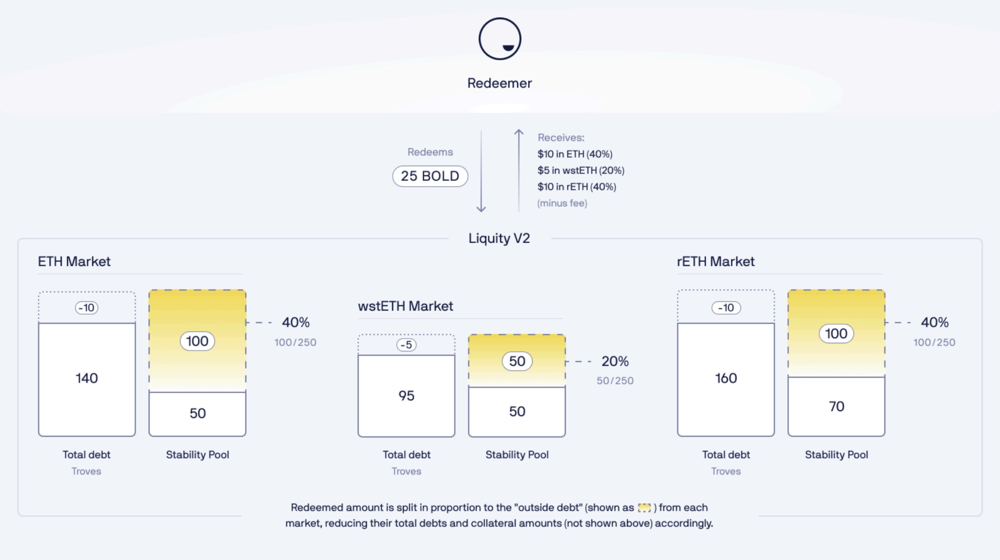
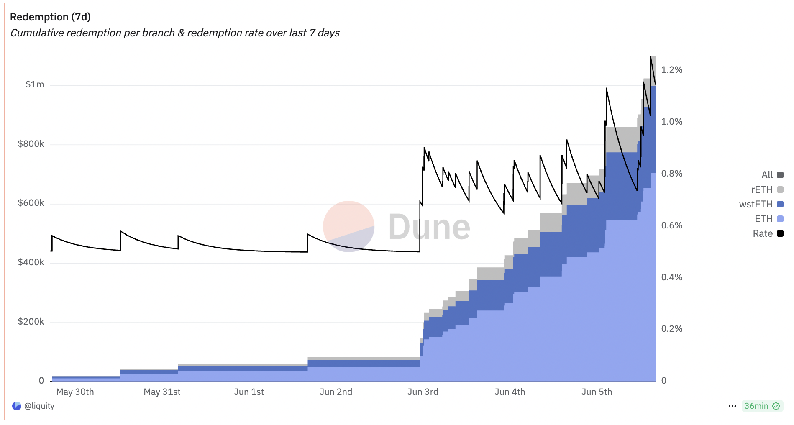
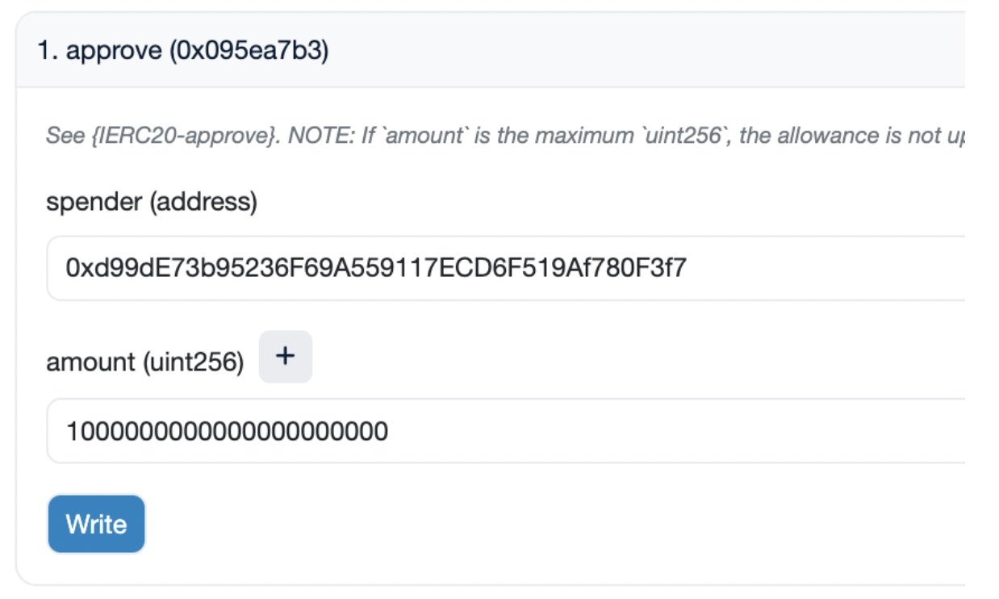

# 赎回与委托

### 什么是赎回？

赎回是保持 BOLD 与美元锚定的关键机制,在不依赖中心化资产或第三方的情况下以去中心化方式创建约 1 美元的价格底线。

赎回本质上是按面值将 BOLD 兑换为 ETH/LST，就好像 1 BOLD 正好值 1 美元。任何人都可以发起赎回，但只有当 BOLD <$1 时才有利可图。

赎回者向协议发送 BOLD，并获得 WETH、wstETH 和 rETH 的组合（减去赎回费）。赎回金额根据当前稳定池支持在不同抵押资产之间分配（有关更多信息，请参见[链接](redemptions-and-delegation.md#docs-internal-guid-6cda6d73-7fff-78b8-1c4f-6cb96385a98a)）。

<figure><figcaption></figcaption></figure>

赎回从支付最少利息的借款人开始。

阅读更多关于如何[保护自己](redemptions-and-delegation.md#how-can-i-stay-protected)免受赎回以及如果[你被赎回](redemptions-and-delegation.md#what-happens-if-my-trove-gets-redeemed)会发生什么。

你还可以观看这个关于赎回的[9 分钟视频](https://www.youtube.com/watch?v=CQVmjFx987A)。

### 赎回何时会发生？ 

赎回可以随时发生，但可能只有在有利可图时才会发生。这通常是 BOLD 的价格低于 1 美元（减去当前赎回费）的情况。

### 谁可以发起赎回？ 

任何以太坊地址都可以发起赎回，前提是他们有足够的 BOLD。然而，我们预计赎回主要由专业机器人而非人类执行。

### 如果我的 Trove 被赎回会发生什么？

你可以将赎回视为其他人偿还你的债务并取回等值的抵押品。

如果你的抵押品（ETH 或 LST）被赎回，相当于你以美元计价的债务被偿还。赎回者收到你的抵押品，减去赎回费，赎回费留在你的 Trove 中。这意味着在赎回时，你可能在美元计价上产生了最小的损失。

以 ETH 价格 3,000 美元为例：

-   赎回前：10 ETH 抵押品，20,000 BOLD 债务。
-   赎回后：5.025 ETH 抵押品，5,000 BOLD 债务。

你可以看到你的抵押品和债务以相等的方式减少（以美元计），赎回费（0.025 ETH）被添加到你的抵押品价值中。

债务保持在 2000 BOLD 最低债务阈值以上的部分受影响的 Trove 继续像以前一样工作，而债务减少到较小金额（或 0）的 Trove 切换到休眠运行模式（有关[更多](redemptions-and-delegation.md#docs-internal-guid-927901d5-7fff-c7a0-2e9f-964ab271257a)信息，请参见下文）。

### 使用三种抵押资产时赎回如何工作？ 

与 LUSD 相比，BOLD 由多种抵押品支持。Liquity V2 不是让赎回者自由选择要赎回的抵押品，而是优化经济安全性的流程。因此，赎回通过抵押品组合提供服务，以增强 BOLD 的整体支持。

该过程从每个抵押品市场中支付最低利率的 Trove 开始，并持续到全部 BOLD 金额兑换为抵押资产。赎回可以是部分或完全的，如下所示。

在这个例子中，rETH 市场显示第一个 Trove 的完全赎回和第二个 Trove 的部分赎回。wstETH 和 ETH 市场分别有一次部分赎回和两次完全赎回。

<figure><figcaption>
跨所有三个抵押品市场的赎回示例
</figcaption></figure>

### 如何确定抵押品分配？

分配是动态的，为系统的经济安全性而优化。逻辑很简单：抵押品越有风险，引导到该市场的赎回量就越多。换句话说，如果一个市场的稳定池相对于其总债务较小，它被认为风险更高，因为在极端事件中出现坏账的可能性更高。

为了减轻这种风险，系统按每种抵押品类型的"外部债务"比例进行赎回。这被计算为针对特定抵押品借入的总债务减去该借贷市场的稳定池规模。

这里有一个例子：假设外部债务金额分别为 100 BOLD、50 BOLD 和 100 BOLD，赎回将导致 40%（WETH）、20%（wstETH）和 40%（rETH）的分配。

<figure><figcaption></figcaption></figure>

### 如果几个 Trove 具有相同的利率会发生什么？

当利率相同时，协议使用"后进先出"。最后设置利率的（通过开设或利率调整）首先被赎回。

示例：

-   Trove A - 3%
-   Trove B - 4%（较早调整）
-   Trove C - 4%（较晚调整）

赎回顺序将是 A、C、B。

### 有赎回费吗？

是的。赎回费机制与 Liquity V1 大致相同，但参数化已调整，导致费用衰减更快。赎回费是从赎回中从系统提取的总 ETH/LST 中扣除的。与 V1 相反，费用不会流向 LQTY 质押者，而是作为用户抵押品的一部分保留。

赎回费基于 `baseRate` 状态变量，该变量会动态更新。`baseRate` 随每次赎回而增加，并根据自上次赎回以来经过的时间呈指数衰减（半衰期为 6 小时）。

每次赎回 x BOLD 时：`baseRate` 根据自上次费用事件以来经过的时间衰减，并按与要赎回的 BOLD 总供应的比例增加，即 `x/total_bold_supply`

赎回费百分比由 `min (0.5% + baseRate, 100%)` 给出。

<figure><figcaption></figcaption></figure>

### 我如何保持受保护？

赎回的风险取决于两个因素：你设置的利率和 BOLD 的价格。

**你设置的利率**决定了在轮到你之前必须赎回多少 BOLD。你的利率越高，在你之前可赎回的 BOLD 就越多，反之亦然。

你可以在任何前端看到这一点，在下面的例子中，数字是 41M。

<figure><figcaption></figcaption></figure>

这意味着必须从系统中移除 41M BOLD 才能到你。然而，这个数字是相对的，你还需要考虑最近的赎回活动。虽然过去的事件不能保证未来的结果，但它们可以作为有用的指南。

例如，如果上周只赎回了 200K BOLD，你的相对安全性要高于赎回了 15M。你可以在我们的 [Dune 仪表板](https://dune.com/liquity/liquity-v2#redemptions)中监控过去的赎回。

**BOLD 的价格**是第二个关键因素。当它的交易价格高于 1 美元时，赎回变得无利可图，应该停止。如果对 BOLD 的需求强劲，它可以长期维持高于 1 美元的价格，就像 LUSD 经常发生的那样。

在这种时期，你可以放心地降低你支付的利率而不增加赎回风险。

### 什么是利率委托？

利率委托是 Liquity V2 中的一项功能，允许借款人将其利率管理委托给第三方。这使他们能够创建被动、不干预的仓位，同时仍保持竞争性利率和低赎回风险。

有三种类型的委托：

-   委托给第三方管理者：为多个 Trove 批次提供预定策略并为服务收取费用的专业实体
-   委托给自动化去中心化合约策略：以自主方式管理利率的预定义策略
-   委托给你自己的钱包：度假时委托给热钱包，或委托给朋友

重要的是要注意，委托人或合约策略除了在预定范围内设置利率外什么都做不了，这显著限制了借款人的风险。

因此，借款人应关注管理者预设的利率范围和最大更新频率（在提前调整的情况下相关）。

### 谁是当前活跃的利率委托人？ 

<table><thead><tr><th width="182.7421875">委托人</th><th>地址</th></tr></thead><tbody><tr><td><a href="https://summerstone.xyz/docs/for-users">Summerstone</a></td><td>见<a href="https://summerstone.xyz/docs/for-users/managed-interest-rates/supported-protocols/bold-from-liquity-v2/index.html#active-strategies">这里</a></td></tr><tr><td><a href="https://trovezero.xyz/">Trove Zero</a></td><td><em>0xe707784292289be3aa0fb6f9d33d420291f98695</em></td></tr><tr><td><a href="https://bolder.cash/rate-strategies?f=bold&#x26;c=combined">Bolder Cash</a></td><td>多个策略，在其<a href="https://bolder.cash/rate-strategies?f=bold&#x26;c=combined">页面</a>上列出。</td></tr><tr><td><a href="https://www.liquity.org/blog/autonomous-interest-manager">自主利率管理器</a></td><td>ETH: <em>0xe507e4d0763851a6287238aadd243948d18ab60a</em> wstETH: <em>0x8869a6fb59a8df330f90d9fbf46ebfaff6d4bc14</em> rETH: <em>0x7700b2d305f47ae82e9598bab6d7ccb57299a82b</em></td></tr><tr><td></td><td></td></tr></tbody></table>

_注意：Liquity AG 不对任何委托人的行为负责。请自行研究。_

### 当我更换委托人时会发生什么？ 

你将加入该委托人的批次，继承其利率。

你还将被收取预付费，这是为了阻止"批次跳跃" - 更多[信息](https://github.com/liquity/bold?tab=readme-ov-file#batches-and-upfront-fees)。

### 如果委托利率的智能合约出现问题会怎样？ 

你的 Trove 不会受到影响 - 唯一受影响的是你仓位设置的利率。

### 我如何委托给自己？

一些用户委托给自己的热钱包，以便在移动中调整利率（例如，在旅行时）。

要做到这一点：

1. 在[这里](https://docs.liquity.org/v2-documentation/technical-docs-and-audits#eth-branch)找到你贷款的抵押品分支。
2. 点击正确分支的 `borrowerOperations` 链接。
3. 在 Etherscan 上，转到 Contract 标签 → Write Contract → Connect Wallet。
4. 找到 `setInterestIndividualDelegate` 函数。
5. 填写所需字段并点击 Write。

### 为什么赎回不是 LTV 和利率的双重功能，而只是利率？ 

鉴于赎回的*存在理由*是减少 BOLD 供应以响应需求下降，而利率驱动需求，基于利率的赎回处理是实现市场均衡的更可持续和有效的杠杆。同时主动管理利率和 LTV 会削弱执行市场级利率和存款收益的能力，同时使系统及其用户的流程复杂化。

### V1 和 V2 之间收取的赎回费有什么区别？ 

在 v2 中，当借款人受到赎回影响时，向赎回者收取的赎回费留在受影响的 Trove 内，而不是像在 Liquity 中那样被转移。

因此，在 Liquity 中 `borrower_loss = redemption_fee + redeemer_gain`，而在 Bold 中是 `borrower_loss = redeemer_gain`。

### 当赎回导致 Trove 的债务低于最低金额时会发生什么？ 

如果赎回金额超过受影响 Trove 的债务，它不会像 Liquity V1 那样关闭，而是以 0 BOLD 债务和剩余抵押品保持开放。完全赎回的 Trove 的所有者可以通过提取剩余抵押品来关闭它，或重新借款使其债务超过 2000 BOLD 的最低值，如需要可以充值其抵押品。

在赎回金额不超过 Trove 债务但会使其保留在 0 到 2000 BOLD 之间的情况下，Trove 将以剩余债务和剩余抵押品保持开放。Trove 的所有者可以通过偿还剩余债务并提取剩余抵押品来关闭它，或如上所述重新借款。

### 如何使用 Etherscan 将 BOLD 赎回为抵押品（ETH、rETH 和 wstETH 的组合）

**步骤 1**

要赎回 BOLD，你首先必须使用 BOLD 代币合约的 approve() 函数授予 CollateralRegistry 合约使用你的 BOLD 的权限。

为此，使用以下链接进入 Etherscan [https://etherscan.io/token/0xb01dd87b29d187f3e3a4bf6cdaebfb97f3d9ab98#writeContract](https://etherscan.io/token/0xb01dd87b29d187f3e3a4bf6cdaebfb97f3d9ab98#writeContract)

通过 `"Connect to Web3"` 连接你的钱包后，设置\
spender 为 `0xd99dE73b95236F69A559117ECD6F519Af780F3f7`，金额至少与你希望赎回的金额一样高，加 18 个零。

**1000 BOLD 的示例：**

<figure><figcaption></figcaption></figure>

**步骤 2**\
现在你可以使用 `CollateralRegistry` 合约赎回 BOLD：

[https://etherscan.io/address/0xd99de73b95236f69a559117ecd6f519af780f3f7#writeContract\
\
](https://etherscan.io/address/0xd99de73b95236f69a559117ecd6f519af780f3f7#writeContract)只需输入要赎回的 BOLD 金额、你愿意接受的赎回费百分比以及每种抵押品的最大列表迭代次数（限制每个分支上可以偿还债务的 Trove 数量）。

注意：赎回费必须高于[当前](https://dune.com/queries/4641717/7730245)费用。

**示例**

`_boldAmount:` 要赎回的金额 \* 1e18

`_maxIterationsPerCollateral:` 0

`_maxFeePercentage:` 1% \* 1e16，即 1000000000000000000

<figure><figcaption></figcaption></figure>
