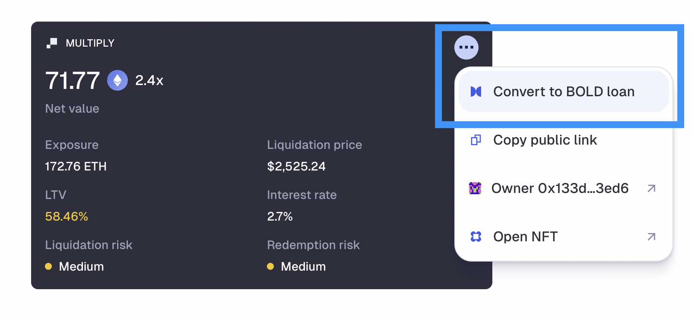

# Borrowing and Multiply

### What makes borrowing in V2 so unique?

Pioneering user-set interest rates, Liquity V2 allows users to borrow the stablecoin BOLD on their own terms. Borrowers can choose and adjust the rate they are willing to pay for their loans. Borrowers will establish market rates in accordance with their individual risk tolerance without relying on governance or algorithm rate management. Each collateral will also have their own respective borrow market which allows room for a market of rates to develop.

Liquity V2 builds on the fundamentals that V1 introduced - a highly secure and immutable protocol which issues the most decentralized stablecoin in all of crypto.

All of this makes for a highly capital efficient, secure and decentralized borrowing experience which cannot be matched anywhere else.

### Why is Liquity not running its own frontend?

To increase decentralization and resiliency of the protocol, Liquity AG does not operate a central frontend. Instead, users can choose from several integrations and community-run instances, giving them the freedom to select the one that best suits their needs.

### How to choose which frontend to use?

Choosing a frontend is a personal decision that depends on various factors, including UI/UX, additional features, and also rate management strategies.

You can choose one here: [https://www.liquity.org/frontend-v2](https://www.liquity.org/frontend-v2)

### Can I run my own local instance?

Yes you can, just follow the instructions here: [https://github.com/liquity/bold/tree/main/frontend/app](https://github.com/liquity/bold/tree/main/frontend/app)

### What is a Trove?&#x20;

A Trove is Liquity’s version of a 'vault'. Each Trove is linked to an Ethereum address, and each address can have multiple Troves.

Each Trove allows you to manage a loan, adjusting collateral and debt values as needed, as well as setting your own interest rate.

### What types of collateral can I use?

You are able to use ETH, Lido ETH (wstETH) and Rocket Pool ETH (rETH).

### Is there a minimum debt?

Yes, a minimum debt of 2,000 BOLD is required for borrowing.

### **When do I need to pay back my loan?**

Loans issued by the protocol do not have a repayment schedule. You can leave your Trove open and repay your debt any time, as long as you maintain a healthy LTV.

### Is there a lockup period?  

There is no lockup period. Users are free to withdraw their collateral deposits whenever they want. As an exception, withdrawals by borrowers are temporarily suspended if the total LTV of a borrow market goes above 75%.

### How do I decide on my LTV?

This depends on your personal preferences, primarily your risk tolerance and how actively you want to manage your position(s). To help with the decision, you'll find preset options on the user interface that can serve as a guide.

<figure><figcaption>
LTV quick-selection options
</figcaption></figure>

Please note that these examples are for illustration purposes only and do not represent definitive risk or safety thresholds. It's essential to determine your own risk tolerance and comfort level as a user.

If your LTV becomes too high, your position will be liquidated.

### What is Multiply?

The Multiply feature allows you to easily increase your exposure to ETH and LSTs in just a few clicks. It automatically acquires additional collateral using freshly minted BOLD — all in a single transaction.

Simply enter the collateral amount and adjust your desired leverage with the slider.

<figure><figcaption>
Multiply view
</figcaption></figure>

You can modify all parameters at any time, giving you full control of your exposure from one central interface.

### What happens under the hood?

Your exposure increases by borrowing BOLD against your ETH or LST and swapping it for more of the same asset, which is then deposited into your position.

Conversely, reducing your exposure involves using some of your ETH or LST to purchase BOLD, which is then used to repay a portion of your debt.

All swaps are executed using a combination of Curve and Uniswap liquidity.

### What's the difference between Loan and Multiply modes?

Liquity V2 offers two ways to view your position - **Loan** and **Multiply**. You can switch it at any time.

<figure><figcaption>
Mode switching
</figcaption></figure>

Both use the same underlying mechanics but differ in how they display and adjust your position. Here’s how they compare:

* **Loan Mode** treats your position as a _standard borrowing setup_.
  * Focus: your BOLD debt and the ETH/LST collateral backing it.
  * You can deposit/withdraw collateral and mint/repay BOLD.
  * Minted BOLD is sent directly to your wallet.
* **Multiply Mode** treats your position as a _leveraged exposure_.
  * Focus: your Net Value - collateral exposure minus debt value.
  * You can increase/decrease exposure, which automatically changes your BOLD debt.
  * Minted BOLD is swapped for ETH/LST and added to your position, compounding exposure.

Most users won’t need to switch modes, but it can be useful in certain cases.\
For instance, if you’ve borrowed BOLD in Loan mode and spent it, you’re effectively leveraged but can’t easily repay.\
Switching to Multiply lets you reduce your exposure (de-lever) and lower liquidation risk - keeping some collateral instead of losing it entirely.

### What are the limitations?

When you adjust your exposure, the value of ETH/LST deposited or withdrawn is approximately equal to the BOLD borrowed or repaid, so in theory, your net position value shouldn't change.

In practice, however, there are additional costs: a BOLD creation fee when increasing exposure, along with swap fees when exchanging BOLD and ETH/LST.&#x20;

Larger exposure adjustments cause higher price impact, meaning the exchange rate worsens as the size increases - this depends on available liquidity in Curve and Uniswap. Extremely large adjustments may not be possible due to insufficient liquidity.&#x20;

These costs reduce your net position value, so avoid adjusting exposure too often and always monitor price impact before confirming an adjustment.

### How do Liquidations work in Liquity V2?

Troves get liquidated if the LTV goes above the maximum value (90.91% for ETH and 83.33% for wstETH and rETH).

Liquity v2 uses Stability Pools as its primary liquidation mechanism to absorb liquidated debt and collateral. Each borrow-market has its own dedicated Stability Pool earning liquidation gains (in the respective collateral) in exchange for burning debt.&#x20;

Just-In-Time liquidations and a redistribution of debt and collateral across borrowers of the same market handle liquidations as a last resort when the Stability Pool is empty.

A liquidated borrower usually incurs a penalty of 5% and will be able to claim the remaining collateral after liquidation.

A special case is when a Redistribution is necessary, then:

* For ETH, the loss amounts to 10% of the debt (at most). That corresponds to a max. loss of 9.09% expressed in terms of collateral.
* For rETH/wstETH the loss is 20% of the debt, corresponding to a max. loss of 16.67% expressed in terms of collateral.

<figure><figcaption></figcaption></figure>

### How am I compensated for liquidating a Trove? 

The liquidation of Troves is connected with certain gas costs which the initiator has to cover. The protocol offers a gas compensation given by the following formula:

`0.0375 WETH + min(0.5% trove_collateral, 2_units_of_LST_or_WETH)`

The `0.0375 WETH` is funded by a [refundable gas deposit](borrowing-and-liquidations.md#what-is-the-refundable-gas-deposit) while the variable `0.5%` part comes from the liquidated collateral, slightly reducing the liquidation gain for Stability Providers.

### What is the max Loan-To-Value (LTV)?

That depends on the collateral type you will use.&#x20;

ETH will have a LTV of 90.91% while wstETH and rETH will have it at 83.33%.

### What is the refundable gas deposit?

To open a new Trove, the protocol requires a liquidation reserve of 0.0375 ETH regardless of the chosen collateral, which is set aside to cover the gas costs of a potential liquidation. The deposit is returned when the Trove is closed by the user (including upon redemptions).

### How much will I pay for my loan?

In Liquity V2, you pay interest on an ongoing basis, making it suitable for short-term loans as well.

The interest you pay is determined by the rate you set yourself. For example, if you borrow 10,000 BOLD at a 5% interest rate, you'll pay \~500 BOLD in interest after one year. This interest is added to your outstanding debt.

When first opening the loan you pay an Upfront Borrowing Fee. This fee is calculated as 7 days’ worth of average interest on the respective collateral branch. By applying this fee, borrowers are discouraged from continually closing and reopening Troves to evade redemptions, as it increases the cost of frequent adjustments.

### What are user-set rates?

In Liquity V2, users can set their own interest rates, giving them full control over costs and improving predictability. This feature allows for adaptability to various market conditions and helps stabilize BOLD's peg.

User-set interest rates facilitate a capital-efficient equilibrium between BOLD borrowers and holders in a fully market-driven manner. Additionally, these rates serve as the primary revenue source for BOLD holders, generating a continuous, sustainable real yield for BOLD depositors and liquidity providers.

Borrowers should set their rates based on their [redemption](redemptions-and-delegation.md#what-are-redemptions) risk tolerance.

Read more about setting your rates [here](https://www.liquity.org/blog/interest-rate-management-in-liquity-v2).

Note that Troves with delegated interest rates face supplementary initial collateral ratio requirements, which limits their maximum LTV when opening or borrowing more; however, the maximum LTV before liquidation remains the same as non-delegated troves.

### Can I adjust the rate?

Yes, you can always adjust your interest rate at any time. Since you as a user get to set your own interest rate, you have full autonomy over your borrowing costs.&#x20;

Note however, that a Premature Adjustment Fee is charges when a borrower changed their interest rate sooner than 7 days after the last adjustment.  This mechanism prevents borrowers from rapidly adjusting their rates to avoid being prioritized in redemption processes, especially when rates are moving toward their redemption thresholds.

### How do I decide on the right rate for me?

Setting an interest rate determines a user’s redemption risk and needs to be aligned with your goals and how actively you want to manage your position.

Users can also  decide to delegate interest rate management to a third party, who can set your interest rate and charge a fee for this service (see [link](redemptions-and-delegation.md#what-is-delegation-of-interest-rates)).

By opting to manage your own rate, you will have to weigh the savings from a lower rate against the higher redemption risk and the increased adjustment frequency with potential additional costs (premature adjustment fees and gas costs).

Since redemptions are performed in ascending order of interest rate (for the respective collateral asset), you will typically want to keep a buffer of other borrowers with lower rates in front of you. Choosing higher rates may increase the recurring costs of your loan, but give you peace of mind regarding unexpected market fluctuations.

You can see the distribution of other users’ rates in a histogram and position yourself accordingly.

<figure><figcaption></figcaption></figure>

Redemptions usually occur when BOLD is trading below $1 minus the current redemption fee. Keeping an eye on the past [redemption activity](https://dune.com/liquity/liquity-v2#redemptions) can help you assess the overall redemption risk, serving as an additional data point for your rate selection.

In general, those willing to actively monitor their positions, or borrowing for shorter periods of time, may opt for lower rates. Conversely users optimizing for a more passive, long-term position would be better off with setting a higher relative interest rate.

### What could the average interest rate be?

These will be set, continuously, by the market and will vary over time. We would expect that, on average, rates should be similar to borrowing on Sky or Aave using ETH or staked ETH. However, due to the flexibility of user-set rates, it is possible that some users will pay significantly lower rates during certain periods.&#x20;

Given that 75% of the interest revenue is directly paid out to BOLD depositors , we further expect that stablecoin deposit yields should be comparable, if not higher than what competing CDP’s and lending markets offer. Thanks to the attractiveness of BOLD and assuming the emergence of external use cases (monetary premium), this could lead to lower borrow rates overall than offered by other platforms. Learn more about the spread between borrowers and lenders in our [article](https://www.liquity.org/blog/liquity-v2-a-de-facto-reference-rate-for-defi).

### What determines the riskiness of my Trove?

There are two key parameters to consider:

* **Loan-to-value (LTV)**: This is based on your debt-to-collateral ratio and affects your risk of [liquidation](borrowing-and-liquidations.md#how-do-liquidations-work-in-liquity-v2).
* **Interest rate (IR)**: You set this rate yourself, and it influences your risk of being [redeemed](redemptions-and-delegation.md#what-are-redemptions).

You have the flexibility to set these parameters as you see fit, allowing you to control the relative riskiness of each Trove. You can create multiple Troves under the same address, enabling you to manage different risk profiles for different portions of your portfolio.

<figure><figcaption></figcaption></figure>

### Are there any other fees related to borrowing?

To impede Trove redemption evasion strategies where borrowers try to minimize their interest payments in an unfair manner, a small “premature adjustment fee” is charged on interest rate changes that happen within less than 7 days since the last adjustment (or the opening of the Trove). The premature adjustment fee is equal to 7 days of average interest on the respective borrow market. Note that this fee differs from the user’s set interest rate.&#x20;

The fee is denominated in BOLD and added to the Trove's debt. The same fee is charged when a new Trove is opened or when its debt is increased (only affecting the added debt).

### How many Troves (loans) can I open with the same address?

You can have multiple open Troves for the same collateral or across different collateral types, all represented as separate NFTs.&#x20;

### Are Troves transferable?

Yes, they are represented as a NFT (ERC-721), hence easily transferable between wallets. When you send the NFT you also send full access to your Trove and all the funds within it.&#x20;

Please note that more advanced strategies like ‘selling’ Trovess on secondary markets like OpenSea comes with inherent risks, and caution is advised.

### How are collateral risks mitigated?

Liquity V2 will have three separate borrow markets for the different collateral types with their  own Stability Pools (for efficient liquidations), user-set interest rates, and LTV factors for their respective assets (ETH, wstETH, and rETH).&#x20;

Risks are mitigated through temporary borrowing restrictions in times of low collateralization of a given market, a redemption logic prioritizing  collateral with less Stability Pool backing, and a collateral shutdown as an emergency measure to maintain system balance and protect against market instability.

Keep in mind that despite all these measures, BOLD remains dependent on the three mentioned collateral assets and there is no strict guarantee that it remains overcollateralized in case of a sudden collapse of a collateral asset.

### How does the system compartmentalize risk among different LSTs? 

This depends on the party in question:

* Borrowers: Collateral risk is limited to the collateral asset held by the borrower. A borrower isn’t negatively affected by a failure of another collateral asset.
* BOLD Holders: As a multi-collateral stablecoin, BOLD is reliant on effective liquidations of undercollateralized loans in every borrow market to remain overcollateralized. Holders are subject to the risks of all supported collateral assets.
* Earners: Stability Pool depositors only get exposure to the asset they have opted for. However, as BOLD holders, they are similarly affected by potential depegging.

### What mechanisms are in place if the Stability Pool is empty?

If the Stability Pool doesn’t cover the full entire debt and gets completely emptied by the liquidation, the system falls back to the following liquidations modes.

The liquidator can freely choose between two fallback liquidation modes for the debt exceeding the funds in the Stability Pool:

1. Just-in-time (JIT) liquidation: the liquidator sends an amount of BOLD corresponding to the (remaining) debt in exchange for 105% of its nominal value in (staked) ETH.
2. Redistribution: the liquidator triggers a redistribution, through which the Trove’s entire debt and collateral is redistributed to all fellow borrowers of the respective collateral market, in proportion to their own collateral amounts. Thus, the respective borrowers will receive a share of the liquidated collateral and see their debts increase proportionally.

### Why was the Recovery Mode removed? 

The removal of Recovery Mode in V2 ensures that borrowers can benefit from a permanently high LTV regardless of the system state, and up to 11x multiplication.

In Liquity V1 it is mainly needed due to a lack of sustainable yield for the Stability Pool, increasing the reliance on redistribution for liquidations in the long term. Liquity V2 pays out a real yield, and aims to keep the Stability Pools backing sufficiently large through its adaptive redemption logic.

As a replacement for the Recovery Mode, the system may shut down borrow markets whose total collateralization ratio (TCR) falls below 110% (for ETH) or 120% (for wstETH and rETH). The shutdown is performed by incentivizing redemptions against the respective collateral (see [this](https://liquity.gitbook.io/v2-whitepaper/liquity-v2-whitepaper/functionality-and-use-cases#c9aukpugrj32) for more details)

Additionally, when the TCR of a branch falls below its "Critical Collateral Ratio” (CCR), the system imposes extra restrictions on borrowing in order to maintain system health and branch overcollateralization.

When the branch TCR falls below the CCR of 150%, these borrowing restrictions apply:

* Opening a Trove: only allowed if it brings the resulting TCR > 150%
* Closing a Trove: only allowed if it brings the resulting TCR > 150%
* Adjusting a Trove: any new borrowing must bring the resulting TCR > 150%, and any collateral withdrawal of value $x USD must be matched by a repayment of at least x BOLD
* Adjusting a Trove’s interest rate: only allowed if it doesn’t mint new debt via a premature adjustment fee

### What to do if I have issues with a frontend?

This is usually caused by ISP or DNS-based geofencing. Try the following:

* Switch to a different [frontend](https://www.liquity.org/frontend-v2) provider
* Change your VPN location (or turn it off)
* Change the RPC in your wallet
* Tether using mobile data
* Disable "secure DNS" in your browser settings

#### What happens when The Graph is down?

The Graph organizes blockchain data for easy frontend access. It’s rarely down, but major events, like the global Cloudflare outage on November 18th, 2025, can cause temporary disruption.

When The Graph is down, blockchain data becomes harder to fetch, which can impact the frontend experience. The blockchain itself is unaffected.

A built-in fallback ensures you can still perform all standard operations using the frontends, such as creating, modifying, or closing loans, adding to or removing from stability pools, staking, or voting.

Limitations during downtime

* If you switched browsers or cleared your history, you might not see your list of open loans. Use DeFiExplore or Rails Finance to find your loan IDs and enter them manually to access your positions.
* If your loan was liquidated or redeemed (partly or fully), the details won’t be visible until The Graph is back online.
* Data such as redemption risk and interest charts is unavailable. If you rely on these metrics, please return once The Graph is restored.

 
