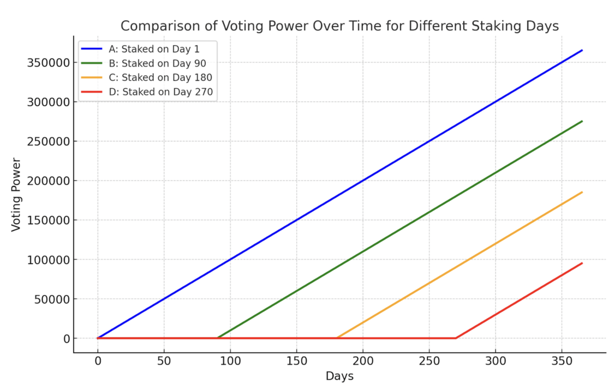
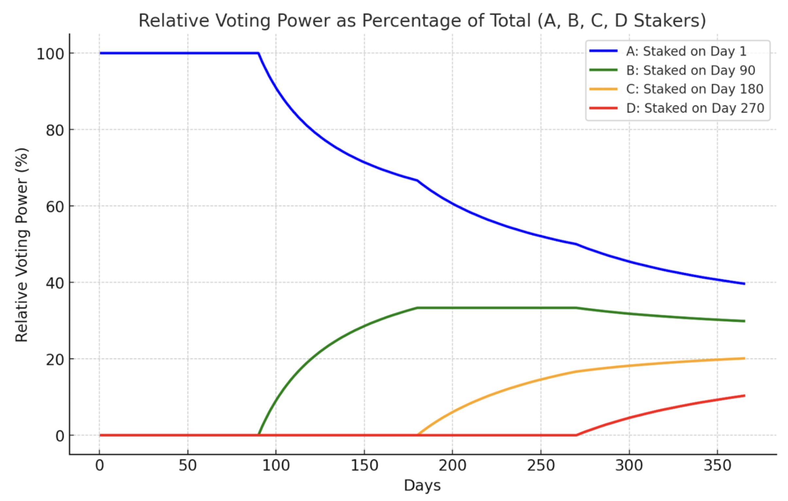

# LQTY Staking & Voting

### What are the benefits of staking LQTY? 

Staking your LQTY in Liquity V2 unlocks a unique, dual-reward opportunity. Not only do you gain influence over the future of Liquity V2, but your stake also continues to earn LUSD and ETH rewards from Liquity V1. This powerful synergy ensures you capitalize on both the stability of V1 and the innovations of V2.

Besides voting power, voters may receive payments (“bribes”) from external initiatives.

### Is there a lock-up? 

No, there is no lock-up. You can withdraw the LQTY at any time.

Be mindful however, that as you withdraw you lose the accumulated “extra” voting power.

### What is Protocol Incentivized Liquidity (PIL)? 

It's a novel sustainable and adaptive incentive mechanism in Liquity v2. It directs 25% of the protocol's revenue to external initiatives, aiming to improve BOLD liquidity and stimulate growth within the entire Liquity ecosystem.

Read more about PIL and voting in this [article](https://www.liquity.org/blog/directing-protocol-incentivized-liquidity-with-lqty).

### Where do the incentives come from? 

Every Trove incurs interest in BOLD every second. The entirety of these proceeds are continuously split between two streams: Stability Pool revenue and Protocol Liquidity Incentives. The percentages are hard-coded to 75% and 25%, respectively, so long as there are active borrowers in the system, there will be a budget for the PIL mechanism.

Example: if BOLD has a market cap of 200m and the average interest rate is 10%, then PIL has 5m BOLD at disposal per year.

### How do I vote on initiatives? 

To vote, you need to stake your LQTY on a [frontend](https://www.liquity.org/frontend-v2).

Once staked, a user’s share of total protocol voting power is determined by a time-weighted calculation.

Users with voting power can weigh initiatives as they see fit, splitting their votes at their liking. These users can select from any combination of initiatives, and their selections remain set across future voting periods until they change it.

Voting takes place during weekly epochs, which begin with the block on Ethereum that follows 00:00 UTC each Thursday, and ends with the last block on the following Wednesday at 23:59:59 UTC.

The voting process is divided into two categories: upvote for and downvote (veto). During each weekly epoch, upvotes and downvotes can be made for initiatives, though in the last 24 hours before the end of the epoch only downvotes are possible. In the final 24-hour period of each epoch, existing votes can still be removed and reallocated  to downvote initiatives.

For proposals and discussions around initiatives, visit the [voting Discourse](https://voting.liquity.org/).

Past voting rounds can be viewed in this Dune [dashboard](https://dune.com/liquity/protocol-incentivized-liquidity).

### Do I need to vote each week? 

No, votes from the previous round carry over to the next one. \
\
It is advisable to keep an eye on new initiatives, as well as those you have already voted for. Being aware of new initiatives allows you to learn about potentially better allocations for your votes. Additionally, previously voted initiatives may be modified or upgraded, and if changes occur, the reasons you originally voted for them may no longer be valid.

### How do I accrue voting power? 

A user's voting power is proportional to the staked LQTY, but increases with time, following a linear growth.&#x20;

`Voting Power = LQTY Staked × Staking Age`

<figure><figcaption></figcaption></figure>

The above chart shows the individual voting power of four users A, B, C and D that have staked the same amount at different times. By dividing their individual voting power by the total voting power, we can determine the relative voting power distribution:

<figure><figcaption></figcaption></figure>

The longer a user stakes, the more voting power they lose with unstaking.

### Can I stake more or partially reduce my stake later? 

Yes, it is possible to increase or reduce an existing stake. Keep in mind that the new amount added starts off with a voting power of 0, while reducing your stake will leave your staking age unchanged.

A new amount added to a pre-existing stake starts off with a voting power of 0 (to prevent flash-loan-like abuses): therefore, right after staking, the total voting power stays the same (the line is continuous), but the slope increases. Conversely, when unstaking, there is an immediate drop (discontinuity) in the user's voting power, besides the obvious decrease of the slope.

### How are new initiatives proposed? 

Any user having at least 0.01% of the total voting power of all LQTY staked and paying the registration fee of 100 BOLD can propose new incentives.

Technically, any Ethereum address can receive Protocol Liquidity Incentives, but it is generally advisable to create a smart contract for the initiative, which contains any logic necessary to direct any received funds which will be paid in BOLD. This contract should be properly reviewed and audited by the proposer to ensure that it is secure and will work as intended.

\[NEW]

Once the initiative is deployed it can be registered.

&#x20;[Here](https://etherscan.io/address/0x6440f144b7e50D6a8439336510312d2F54beB01D#writeContract) you need to call the `approve` function:

* Enter the `spender` address: `0x807DEf5E7d057DF05C796F4bc75C3Fe82Bd6EeE1`
* Enter at least 100 BOLD (100 \* 1e18) under `amount`

Then register it [here](https://etherscan.io/address/0x807def5e7d057df05c796f4bc75c3fe82bd6eee1#writeContract) by entering your `_initiative` address under `registerInitiative`

\[OLD]

The proposer should deploy the initiative to Ethereum, and then call `registerInitiative(address _initiative)` on the `Governance.sol` contract, paying 100 BOLD for registration.

Once registered, the initiative can be voted upon in the following epoch. For efficiency reasons, only initiatives which would receive a minimum 2% of the votes are eligible. Initiatives failing to reach this threshold during four or more consecutive epochs may be permissionlessly unregistered.

### How are incentives distributed? 

Protocol Liquidity Incentives accrue and are then distributed on a weekly cadence across to all qualifying initiatives, or target addresses.&#x20;

To qualify for incentives, an initiative must reach a relative threshold of 2% of all votes.

The incentive distribution is a function of gauge weighting between all qualifying initiatives: the incentives are split in proportion to the relative votes (without counting the downvotes as long as the initiatives qualify).

Incentives **must be claimed in the same week**, else they get redistributed to the next week's round.

### What happens to downvoted initiatives?

Initiatives, which have more upvotes than the relative threshold of 2%, and receiving more downvotes than upvotes are disqualified from incentives if the number of downvotes exceeds the number of upvotes. Such initiatives can be deregistered by anyone.

### What happens to inactive or unpopular initiatives?

Initiatives that fail to reach the qualifying threshold or the minimum weekly claim for more 4 consecutive epochs (weeks) can be deregistered by anyone.

