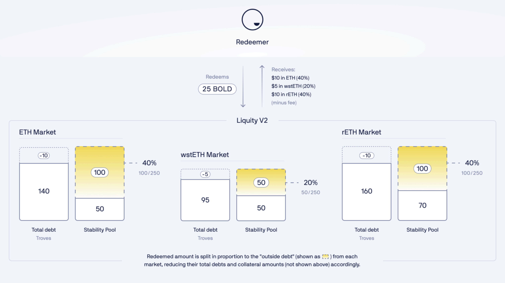
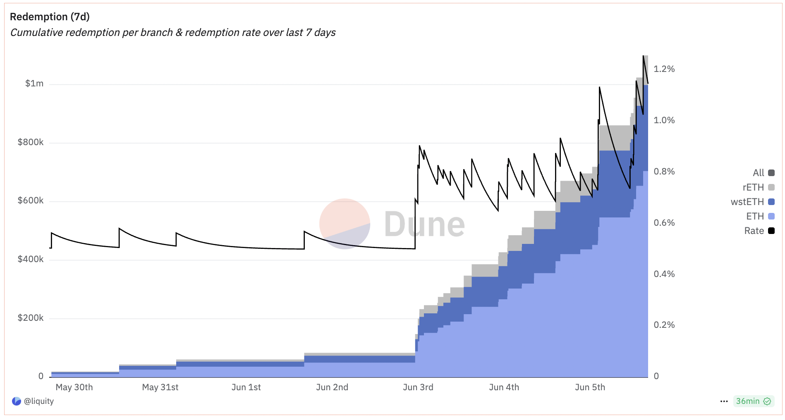
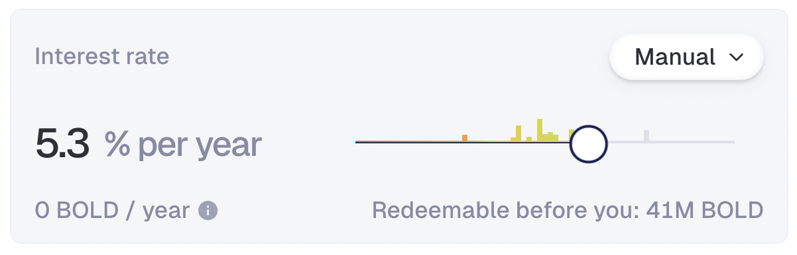
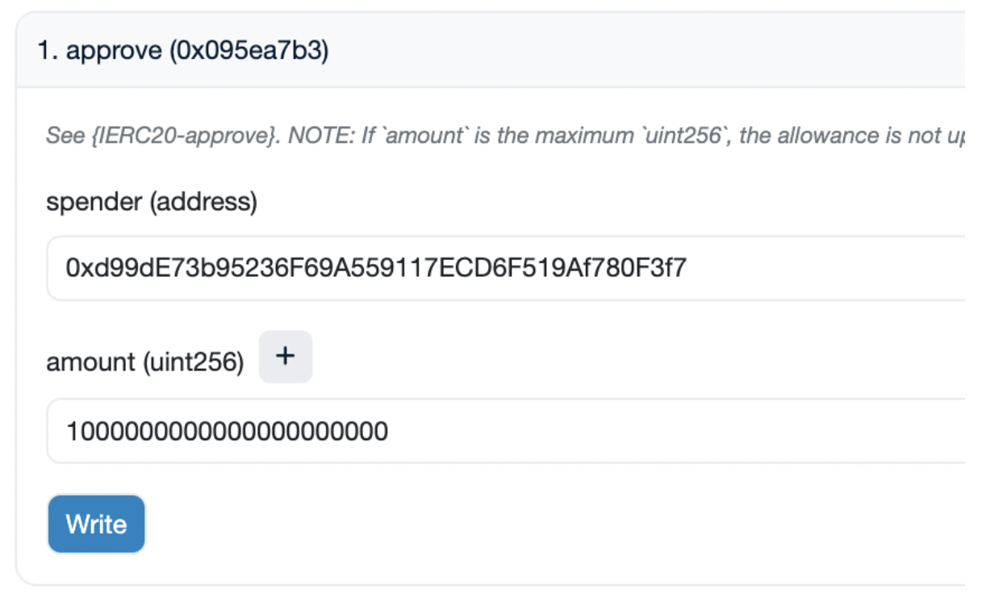

# Redemptions and Delegation

### What are redemptions?

Redemptions serve the crucial purpose of keeping BOLD pegged to the US Dollar, creating a price floor around $1. They do this in a decentralized way without reliance on centralized assets or 3rd parties.

A redemption is essentially swapping BOLD for ETH/LST at face value, as if 1 BOLD is exactly worth $1. Redemptions can be initiated by anyone, but are only profitable when BOLD <$1.

The redeemer sends BOLD to the protocol and in return gets a mix of WETH, wstETH and rETH (minus the redemption fee). The redeemed amount is split among the different collateral assets based on their current Stability Pool backing (see [link](redemptions-and-delegation.md#docs-internal-guid-6cda6d73-7fff-78b8-1c4f-6cb96385a98a) for more info).

<figure><figcaption></figcaption></figure>

Redemptions start from the borrower paying the least interest.

Read more about how to [protect yourself ](redemptions-and-delegation.md#how-can-i-stay-protected)from redemptions and what happens if [you are redeemed](redemptions-and-delegation.md#what-happens-if-my-trove-gets-redeemed).

You can also watch this [9 min video](https://www.youtube.com/watch?v=CQVmjFx987A) on redemptions.

### When can redemptions occur? 

A redemption can occur at any time, but will likely only happen when it is profitable to do so. This is usually the case when the price of BOLD is less than $1 (minus the current redemption fee).

### Who can initiate a redemption? 

Any Ethereum address can initiate a redemption, provided that they have a sufficient amount of BOLD to do so. However, we expect redemptions to be mainly performed by professional bots rather than humans.

### What happens if my Trove gets redeemed?

You can think of redemptions as if somebody else is repaying your debt and retrieving an equivalent amount of your collateral in return.

If your collateral (ETH or LST) is redeemed, an equivalent amount of your debt in USD terms is repaid. The redeemer receives your collateral, less the redemption fee, which remains in your Trove. This means that at the time of redemption you likely incurred a minimal loss in USD terms.

Example with ETH at $3'000:

* Before the redemption: 10 ETH collateral, 20'000 BOLD debt.
* After the redemption: 5.025 ETH collateral, 5'000 BOLD debt.

You can see your collateral and debt reduced equally (in USD terms) and the redemption fee (0.025 ETH) being added to your collateral value.

Partially affected Troves whose debt stays above the minimum debt threshold of 2000 BOLD continue to work as before, while Troves whose debt is reduced to a lesser amount (or 0) switch to a dormant operating mode (see below for [more](redemptions-and-delegation.md#docs-internal-guid-927901d5-7fff-c7a0-2e9f-964ab271257a) info).

### How do redemptions work using three collateral assets? 

In contrast to LUSD, BOLD is backed by a multitude of collaterals. Instead of letting the redeemer freely choose the collateral to redeem, Liquity V2 optimizes the process for economic safety. Redemptions are thus serviced through a collateral mix in a way that enhances the overall backing of BOLD.

The process starts with the Troves paying the lowest interest rates in each collateral market and continues until the full amount of BOLD is exchanged for collateral assets. Redemptions can be partial or full, as illustrated below.

In this example, the rETH market shows a full redemption of the first Trove and a partial redemption of the second. The wstETH and ETH markets have one partial and two full redemptions, respectively

<figure><figcaption>
Example redemption across all three collateral markets
</figcaption></figure>

### How is the collateral split determined?

The split is dynamic, optimizing for the economic safety of the system. The logic is straightforward: the riskier a collateral is, the more redemption volume is directed to that market. In other words, if a market's Stability Pool is relatively small compared to its total debt, it's considered riskier, as there's a higher likelihood of bad debt occurring in extreme events.

To mitigate this risk, the system redeems proportionally to the "outside debt" of each collateral type. This is calculated as the total debt borrowed against a specific collateral minus the size of the Stability Pool for that borrowing market.

Here is an example: given outside debt amounts of 100 BOLD, 50 BOLD and 100 BOLD respectively, a redemption will result in a 40% (WETH), 20% (wstETH) and 40% (rETH) split.

<figure><figcaption></figcaption></figure>

### What happens if several Troves have the same interest rate?

When rates are identical, the protocol uses "last-in-first-redeemed". The last to set their rate (either by opening or rate adjustment) gets redeemed first.

Example:

* Trove A - 3%
* Trove B - 4% (adjusted earlier)
* Trove C - 4% (adjusted later)

The redemption order will be A, C, B.

### Is there a redemption fee?

Yes. The redemption fee mechanics are broadly the same as in Liquity V1, but with adapted parametrization leading to a faster fee decay. The redemption fee is taken as a cut of the total ETH/LST drawn from the system in a redemption. Contrary to V1, the fee does not go to the LQTY stakers but stays with the users as part of their collateral.

Redemption fees are based on the `baseRate` state variable, which is dynamically updated. The `baseRate` increases with each redemption, and exponentially decays according to time passed since the last redemption (half-life of 6 hours).

Upon each redemption of x BOLD: `baseRate` is decayed based on time passed since the last fee event and incremented by an amount proportional to the fraction of the total BOLD supply to be redeemed, i.e. `x/total_bold_supply`

The redemption fee percentage is given by `min (0.5% + baseRate, 100%)`.

<figure><figcaption></figcaption></figure>

### How can I stay protected?

The risk of redemption depends on two factors: the interest rate you set and the price of BOLD.

**The interest rate** you set determines how much BOLD must be redeemed before it's your turn. The higher your rate, the more BOLD is redeemable before you, and vice versa.

You can see this on any frontend, in the example below the number is 41M.

<figure><figcaption></figcaption></figure>

This means that 41M BOLD must be removed from the system before it would reach you. However, this number is relative, and you also need to consider recent redemption activity. While past events don't guarantee future outcomes, they can serve as a useful guide.

For example, if only 200K BOLD were redeemed in the last week, you're comparatively safer than if 15M were redeemed. You can monitor past redemptions in our [Dune dashboard.](https://dune.com/liquity/liquity-v2#redemptions)

**The price of BOLD** is the second crucial factor. When it trades above $1, redemptions become unprofitable and should cease. If demand for BOLD is strong, it can maintain a price above $1 for an extended period, as was often the case for LUSD.

During such times, you can comfortably reduce the interest rate you're paying without increasing your risk of redemption.

### What is delegation of interest rates?

Interest rate delegation is a feature in Liquity V2 that allows borrowers to delegate the management of their interest rate to a third party. This enables them to create a passive, hands-off position, while still keeping a competitive rate and low redemption risk.

There are three types of delegations:

* To a third party manager: A specialized entity which provides predetermined strategies for batches of multiple Troves and charges a fee for the service
* To an automated and decentralized contract strategy: A predefined strategy managing interest rates in an autonomous manner
* To your own wallet: Delegate to a hot wallet when on vacation, or to a friend

It is important to note that a delegate or contract strategy can do nothing else but set the interest rate in a predetermined range, significantly limiting the risks of the borrowers.

Borrowers should thus keep an eye on the interest rate range and the maximum update frequency (relevant in case of premature adjustments) preset by the manager.

### Who are the current active interest rate delegates? 

| Entity                                                                              | Collateral Asset | Strategies |
| ----------------------------------------------------------------------------------- | ---------------- | ---------- |
| [Bolder Cash](https://bolder.cash/rate-strategies?f=bold\&c=combined)               | All              | 3          |
| [Trove Zero](https://trovezero.xyz/)                                                | All              | 1          |
| [Summerstone](https://summerstone.xyz/docs/for-users)                               | All              | 1          |
| [Autonomous Rate Manager](https://www.liquity.org/blog/autonomous-interest-manager) | All              | 1          |

_Note that Liquity AG is not responsible for the actions of any delegates. Please do your own research._

### What happens when I change delegates? 

You will join that delegate's batch inheriting its interest rate.

You will be also charged the upfront fee, this is in place to stop "batch hopping" - more [info](https://github.com/liquity/bold?tab=readme-ov-file#batches-and-upfront-fees).

### What happens if there are issues with the smart contract for delegating interest rates? 

Your Trove would not be affected - the only thing would get affected is the interest rate at which your position is set.

### How can I delegate to myself?

Some users delegate to their own hot wallets so they can adjust rates on the go (e.g. while traveling).

To do it:

1. Find the collateral branch of your loan [here](https://docs.liquity.org/v2-documentation/technical-docs-and-audits#eth-branch).
2. Click on the `borrowerOperations` link of the right branch.
3. On Etherscan, go to the Contract tab → Write Contract → Connect Wallet.
4. Find the `setInterestIndividualDelegate` function.
5. Fill in the required fields and click Write.

### Why are redemptions not a feature of both LTV & interest rate, but only interest rate? 

Given that the _raison d’etre_ for redemptions is to diminish BOLD supply in response to reduced demand, and interest rates drive demand, rate-based redemption processing is a more sustainable and effective lever to reach market equilibrium. Actively managing for both interest rate and LTV would weaken the ability to enforce market-level interest rates and deposit yields, while complicating the process for the system and its users

### What’s the difference in redemption fees charged between V1 and V2? 

In v2, when borrowers are affected by redemptions, the redemption fee charged to the redeemer stays within the affected Troves instead of being diverted as in Liquity.

So, in Liquity the `borrower_loss = redemption_fee + redeemer_gain`, while in Bold it’s `borrower_loss = redeemer_gain`.

### What happens when redemptions cause a debt of a Trove to fall below the minimum amount? 

If the redeemed amount exceeds the debt of an affected Trove, it doesn’t get closed as in Liquity V1, but remains open with 0 BOLD debt and the remaining collateral. The owner of a fully redeemed Trove may close it by withdrawing the remaining collateral, or borrow anew to bring its debt above the minimum of 2000 BOLD, topping up its collateral if needed.

In the scenario that the redeemed amount of a Trove does not exceed the debt of a Trove, but would leave it between 0 and 2000 BOLD, the Trove would remain open with the remaining debt, and the remaining collateral. The owner of the Trove may close it by paying off the remaining debt and withdrawing the remaining collateral, or borrow anew as described above.

### How to redeem BOLD for collateral (mix of ETH, rETH and wstETH) using Etherscan

**Step 1**

To redeem BOLD you first have to give the CollateralRegistry contract an approval to use your BOLD using the approve() function of the BOLD token contract.

For that matter, go to Etherscan using the following link [https://etherscan.io/token/0xb01dd87b29d187f3e3a4bf6cdaebfb97f3d9ab98#writeContract](https://etherscan.io/token/0xb01dd87b29d187f3e3a4bf6cdaebfb97f3d9ab98#writeContract)

After connecting your wallet through `“Connect to Web3”`, set\
spender to `0xd99dE73b95236F69A559117ECD6F519Af780F3f7`and the amount to be at least as high as the amount you wish to redeem, adding 18 zeros.

**Example for 1000 BOLD:**

<figure><figcaption></figcaption></figure>

**Step 2**\
You can now redeem BOLD using the `CollateralRegistry` contract:

[https://etherscan.io/address/0xd99de73b95236f69a559117ecd6f519af780f3f7#writeContract\
\
](https://etherscan.io/address/0xd99de73b95236f69a559117ecd6f519af780f3f7#writeContract)Simply input the BOLD amount to redeem, the redemption fee percentage you are willing to accept and the maximum number of list iterations per collateral (limits the number of troves whose debt can be repaid on each branch).

Note: The redemption fee must be higher than the [current](https://dune.com/queries/4641717/7730245) fee.

**Example**

`_boldAmount:` amount to redeem \* 1e18

`_maxIterationsPerCollateral:` 0

`_maxFeePercentage:` 1% \* 1e16, i.e. 1000000000000000000

<figure><figcaption></figcaption></figure>
